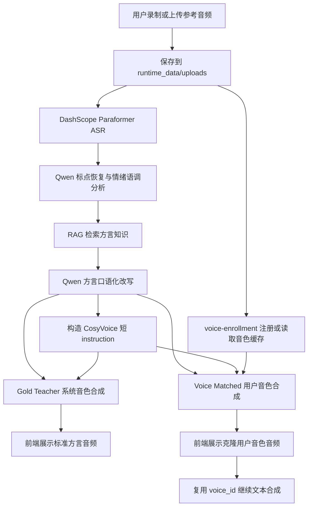

# 声临其境：濒危方言的声音复刻与活化平台

“声临其境”是一个面向方言保护、学习和传播的 AI Web 应用。用户在手机或电脑上录制或上传一段参考语音，系统会完成语音识别、标点与情绪语调分析、方言口语化改写、音色注册和方言语音合成，最终输出带有用户音色的粤语、四川话或闽南话语音。

项目定位不是简单的“文字转方言”，而是把语义、方言表达、情绪语调和个人音色串成一条可演示、可部署、可继续扩展的闭环。

## 项目信息

- 项目名称：声临其境
- 项目方向：数字人文、方言保护、AI 语音交互
- 项目组别：人文与艺术组
- 开发者：暨南大学信科院数学系 yiyangli
- 开发周期：2026-04-28 至 2026-05-16
- 指导教师：陈清亮教授
- 当前形态：FastAPI 后端 + 单页 Web 前端 + DashScope/Qwen/CosyVoice 云端模型编排

## 核心能力

- 移动端和桌面端录音、上传与试听。
- 支持粤语、四川话、闽南话三种目标方言。
- 使用 ASR 将参考音频转成中文文本。
- 使用 LLM 恢复标点、判断情绪、生成短语调提示。
- 使用 LLM 将普通话语义改写为自然方言口语。
- 使用 CosyVoice 方言 `instruction` 控制目标方言发音。
- 使用 voice enrollment 注册或复用用户音色。
- 同时输出系统音色的 Gold Teacher 和用户音色的 Voice Matched。
- Voice Matched 成功后，可继续输入文本并复用已注册音色再次合成。

## 使用的模型与服务

当前仓库默认采用云端 API 编排路线，避免在 50G/双核轻量服务器上部署大型本地语音模型。

| 环节 | 默认模型或服务 | 作用 |
| --- | --- | --- |
| ASR | DashScope `paraformer-v2` | 将上传音频转写为中文文本 |
| LLM | DashScope OpenAI-compatible `qwen3.7-max` | 恢复标点、提取情绪语调、生成方言口语文本 |
| 标准 TTS | DashScope CosyVoice `cosyvoice-v3-plus` | 生成系统音色的 Gold Teacher 方言音频 |
| 音色注册 | DashScope `voice-enrollment` | 根据 10-20 秒参考音频创建或复用 `voice_id` |
| 音色复刻 TTS | DashScope CosyVoice `cosyvoice-v3.5-plus` | 使用已注册音色生成 Voice Matched 方言音频 |
| 方言控制 | CosyVoice `instruction` | 使用“请用广东话/四川话/闽南话表达”等短指令控制发音 |

关键配置位于 [app/config.py](app/config.py)，可通过 `.env` 覆盖模型名、接口地址、运行端口、缓存目录和清理策略。

## 端到端链路



实际后端编排在 [app/pipeline.py](app/pipeline.py) 中，核心顺序是：

1. 清理过期运行缓存，控制服务器磁盘增长。
2. 保存上传音频，并检查参考音频时长。
3. 调用 `transcribe_audio` 得到原始 ASR 文本。
4. 调用 `analyze_expression` 恢复标点、生成 `emotion_label` 和 `prosody_instruction`。
5. 调用 RAG 检索方言词汇/习惯表达，作为改写 prompt 的参考上下文。
6. 调用 `rewrite_to_dialect` 生成目标方言口语文本。
7. 调用 `build_tts_instruction` 合并方言指令和情绪语调，例如“请用广东话表达，语气焦急，停顿更短。”。
8. 先生成 Gold Teacher，再注册或复用用户音色。
9. 使用同一段方言文本和同一条短指令合成 Voice Matched。
10. 前端优先推荐 Voice Matched；失败时保留 Gold Teacher 并展示警告。

## 旧本地链路与失败经验

本项目吸收了旧工作区local ASR model中本地全流程项目的经验。旧路线曾尝试：

```text
音频输入 -> FireRedASR/VAD/LID/Punc -> LLM 审查纠错与方言改写
-> Qwen/DashScope Gold Teacher -> OpenVoice/RVC 或 Qwen VC 音色迁移
```

旧项目证明了“本地全链路闭环”在技术上可行，但也暴露出几个关键问题：

- 本地 FireRedASR、OpenVoice、RVC 等组件对 GPU、模型文件、Python 环境和路径编码要求较高，不适合直接部署到小型公网服务器。
- 早期公网链路中，上传音频后曾绕过方言改写，导致 ASR 的普通话文本直接进入 TTS，输出退化为普通话读文本。
- 只依赖“方言字面文本”不能稳定保证方言发音，最终听感必须由具备方言能力的 TTS 或明确的方言 instruction 承担。
- Voice Matched 必须和 Gold Teacher 区分：Gold Teacher 负责“怎么说”，Voice Matched 负责“像谁说”；复刻失败时不能伪装成成功。
- WebSocket 实时流在移动端公网环境不够稳定，比赛演示主链路应优先使用 HTTP 文件式输出。

因此当前仓库采用更轻量、更稳定的云端 API 编排：

```text
音频 -> Paraformer ASR -> Qwen 情绪/标点/方言改写
-> CosyVoice 方言 instruction -> voice-enrollment -> CosyVoice 用户音色合成
```

旧本地链路仍可作为后续研究参考：如果未来需要更强的韵律迁移、语音风格迁移或离线运行能力，可以重新引入 FireRedASR、OpenVoice/RVC 或其他 audio-to-audio 模型，但不应破坏当前公网可演示主链路。

## 项目结构

```text
.
├── app/
│   ├── main.py          # FastAPI 入口：首页、健康检查、转换和复用音色合成接口
│   ├── models.py        # API 响应模型
│   ├── pipeline.py      # ASR、情绪分析、方言改写、音色注册、TTS 主编排
│   ├── providers.py     # DashScope/Qwen/CosyVoice API 调用
│   ├── storage.py       # 上传、输出、元数据、音色缓存和运行时清理
│   ├── audio_utils.py   # 音频预览、时长校验和移动端格式处理
│   └── config.py        # 环境变量与默认模型配置
├── static/              # 单页前端：录音、上传、结果展示、复用 voice_id 合成
├── tests/               # 单元测试
├── scripts/             # 腾讯云部署脚本
├── docs/                # 执行记录与技术文档
└── runtime_data/        # 运行时数据，已被 .gitignore 排除
```

## 本地运行

### 1. 安装依赖

```bash
python -m venv .venv
.venv\Scripts\activate
pip install -r requirements.txt
```

Linux 或 WSL：

```bash
python3 -m venv .venv
source .venv/bin/activate
pip install -r requirements.txt
```

### 2. 配置环境变量

复制示例配置：

```bash
cp .env.example .env
```

至少需要配置：

```env
DASHSCOPE_API_KEY=your_dashscope_key
QWEN_LLM_API_KEY=your_dashscope_key
PUBLIC_BASE_URL=http://你的公网地址或可被 DashScope 回拉的地址
```

### 3. 环境变量说明

| 变量 | 是否必填 | 默认值 | 说明 |
| --- | --- | --- | --- |
| `DIALECT_SERVICE_HOST` | 否 | `0.0.0.0` | FastAPI 监听地址 |
| `DIALECT_SERVICE_PORT` | 否 | `7860` | FastAPI 监听端口 |
| `PUBLIC_BASE_URL` | 真实转换必填 | 空 | 公网可访问的服务地址，ASR 和音色注册需要用它回拉上传音频 |
| `CORS_ALLOW_ORIGINS` | 否 | `*` | 跨域来源，生产环境可改为指定域名 |
| `DASHSCOPE_API_KEY` | 必填 | 空 | DashScope ASR、CosyVoice TTS、音色注册的主要密钥 |
| `QWEN_LLM_API_KEY` | 否 | 回退到 `DASHSCOPE_API_KEY` | Qwen LLM 的密钥；为空时会尝试使用 DashScope 密钥 |
| `QWEN_LLM_BASE_URL` | 否 | `https://dashscope.aliyuncs.com/compatible-mode/v1` | Qwen OpenAI-compatible 接口地址 |
| `QWEN_LLM_MODEL` | 否 | `qwen3.7-max` | 标点、情绪语调和方言改写使用的 LLM |
| `ASR_PROVIDER` | 否 | `dashscope_paraformer` | ASR provider 标识 |
| `ASR_MODEL` | 否 | `paraformer-v2` | DashScope Paraformer 模型名 |
| `ASR_BASE_URL` | 否 | DashScope ASR transcription URL | ASR 任务提交地址 |
| `DASHSCOPE_TASK_URL` | 否 | DashScope tasks URL | ASR 异步任务轮询地址 |
| `TTS_PROVIDER` | 否 | `dashscope_cosyvoice` | TTS provider 标识 |
| `QWEN_TTS_BASE_URL` | 否 | `https://dashscope.aliyuncs.com/compatible-mode/v1` | TTS 配置入口；代码会转到 DashScope SpeechSynthesizer |
| `QWEN_TTS_MODEL` | 否 | `cosyvoice-v3-plus` | Gold Teacher 系统音色合成模型 |
| `QWEN_TTS_VOICE` | 否 | `longanyang` | Gold Teacher 默认系统音色 |
| `VOICE_MATCH_PROVIDER` | 否 | `cosyvoice_clone` | Voice Matched provider 标识 |
| `QWEN_VOICE_ENROLLMENT_MODEL` | 否 | `voice-enrollment` | 音色注册模型 |
| `QWEN_VOICE_TARGET_MODEL` | 否 | `cosyvoice-v3.5-plus` | 注册音色后用于合成的目标模型，需和注册时一致 |
| `QWEN_TTS_VC_MODEL` | 否 | `cosyvoice-v3.5-plus` | 兼容旧音色迁移配置；当前主链路使用 `QWEN_VOICE_TARGET_MODEL` |
| `QWEN_VOICE_ENROLLMENT_URL` | 否 | DashScope customization URL | 音色注册接口地址 |
| `QWEN_VOICE_CACHE_DIR` | 否 | `runtime_data/voice_cache` | 音色缓存目录 |
| `MAX_UPLOAD_MB` | 否 | `30` | 上传音频大小限制 |
| `CLEANUP_AFTER_HOURS` | 否 | `24` | 上传和输出文件保留小时数 |
| `VOICE_CACHE_TTL_HOURS` | 否 | `720` | 音色缓存保留小时数 |
| `API_REQUEST_TIMEOUT_S` | 否 | `90` | 外部 API 请求超时时间 |
| `API_MAX_RETRIES` | 否 | `3` | 外部 API 瞬时错误重试次数 |
| `SPEAKER_REF_AUDIO_MIN_S` | 否 | `10` | 参考音频最短时长 |
| `SPEAKER_REF_AUDIO_MAX_S` | 否 | `20` | 参考音频最长时长 |
| `ENABLE_MOCK_WHEN_NO_KEY` | 否 | `0` | 无密钥时启用本地 mock，适合 UI 和单元测试，不产生真实音频 |

本地纯界面或单元测试可以设置：

```env
ENABLE_MOCK_WHEN_NO_KEY=1
```

注意：ASR 和音色注册需要云端能访问上传音频，因此真实转换不能只使用 `localhost` 作为 `PUBLIC_BASE_URL`。

### 4. 启动服务

```bash
uvicorn app.main:app --host 0.0.0.0 --port 7860
```

打开：

```text
http://127.0.0.1:7860
```

健康检查：

```bash
curl http://127.0.0.1:7860/health
```

## API

### `POST /api/convert`

上传音频并生成方言语音。

表单字段：

- `audio`：音频文件。
- `dialect`：`cantonese`、`sichuanese` 或 `hokkien`。

响应包含：

- `source_text`：带标点的识别文本。
- `dialect_text`：方言口语化文本。
- `emotion_label`：情绪标签。
- `prosody_instruction`：语调提示。
- `gold_audio_url`：系统音色方言音频。
- `voice_matched_audio_url`：用户音色方言音频。
- `recommended_audio_url`：推荐播放音频。
- `voice_id`：可复用的注册音色 ID。
- `warnings`：外部服务失败或回退信息。

### `POST /api/speak-with-voice`

复用已有 `voice_id`，把新输入文本合成为同一用户音色的方言音频。

表单字段：

- `dialect`：目标方言。
- `voice_id`：上一次转换返回的音色 ID。
- `text`：要朗读的文本，当前限制 180 字以内。

## 移动端录音适配

前端优先使用 `navigator.mediaDevices.getUserMedia` 和 `MediaRecorder` 在网页内录音，并通过 `MediaRecorder.isTypeSupported()` 自动选择 `audio/mp4`、`audio/webm`、`audio/ogg` 等可用格式。

当手机 HTTP 页面或浏览器不支持网页内录音时，前端会降级到：

```html
<input type="file" accept="audio/*" capture="microphone">
```

后端允许常见移动端音频格式，包括 `.m4a`、`.mp4`、`.3gp`、`.3gpp`、`.caf`、`.amr`、`.webm`、`.wav`、`.mp3`。非 `wav/mp3/m4a` 格式进入音色注册前会尽量通过 `ffmpeg` 转为 MP3。

## 测试

```bash
pytest -q
```

测试覆盖：

- FastAPI 转换接口和错误清洗。
- 主链路 Voice Matched 优先级和 Gold Teacher 回退。
- 已注册音色继续合成。
- 运行时缓存清理和音色缓存 TTL。
- 移动端音频扩展名识别。
- CosyVoice 方言与情绪 instruction 拼接。

## 部署

推荐在 WSL/Ubuntu 或 Linux 中部署，避免 PowerShell 在中文路径、ZIP 打包和远端 UTF-8 文件名上的不稳定问题。

```bash
cd /mnt/d/dialect\ convert
bash scripts/deploy_tencent_cloud_tar.sh 43.139.53.84 root /opt/dialect-convert 7860 http://43.139.53.84
```

部署后检查：

```bash
curl -s http://43.139.53.84/health
ssh -i ~/.ssh/dialectconvert_key.pem root@43.139.53.84 "systemctl is-active dialect-convert"
```

生产环境建议使用 Nginx 和 HTTPS 反向代理。HTTPS 能提升移动端网页内录音兼容性，也能避免浏览器禁用 `getUserMedia`。

## 安全与运行约束

- 不提交 `.env`、私钥、API key、上传音频、输出音频和运行缓存。
- 不在日志、README、提交信息或 issue 中暴露真实密钥。
- `runtime_data/` 已被 `.gitignore` 排除。
- 服务器磁盘有限时，依赖 `cleanup_runtime`、`CLEANUP_AFTER_HOURS` 和 `VOICE_CACHE_TTL_HOURS` 控制增长。
- CosyVoice `instruction` 应保持短句，避免超长指令影响方言输出或触发接口限制。
- `voice_id` 是可复用音色标识，应按运行数据管理，不作为公开示例写入仓库。

## 当前边界

- 当前实现更关注稳定公网演示，不在服务器本地部署 FireRedASR、OpenVoice 或 RVC。
- CosyVoice `instruction` 可以控制方言、情绪和角色倾向，但不是完整的语音风格迁移模型。
- 如果要严格复制输入音频的每个停顿、音高曲线和情绪强度，需要额外的韵律分析或 audio-to-audio 风格迁移能力。
- 方言文本是可解释中间层，最终效果仍以合成音频听感为准。
